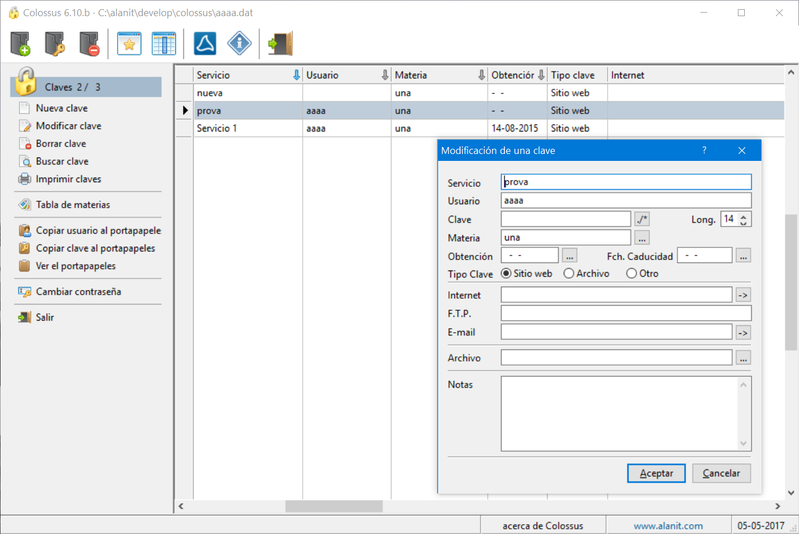

# Colossus 6.10 #

Aplicación personal de gestión de contraseñas, que almacena las claves en un fichero dbf encriptado con ADS.

Esta aplicación requiere Borland C, Harbour y FivewinHarbour para compilarse. Yo uso FWH 14.06 y la versión correspondiente de Harbour empaquetada por Fivetech. Para compilar el programa hay que hacer lo siguiente:

* Ejecutar make cls1406 que compila los fuentes y crea el ejecutable

El archivo de compilación es cls1406.mak y el archivo de enlazado es cls1406.bc. Las rutas de los compiladores y librerias están en el archivo .mak.

Mi editor es HippoEdit (http://www.hippoedit.com) y el archivo colossus.heprj es el archivo de proyecto para ese editor.

La estructura de carpetas de la aplicación es la siguiente:

\ contiene los archivos de compilación y enlazado, así como las DLL necesarias para ejecutar el programa.
\ch contiene los archivos de preprocesador de las librerias que utilizo
\obj carpeta donde se depositan los objetos de la compilación
\prg carpeta con los fuentes. No se incluyen report.prg, rpreview.prg ni image2pdf.prg por ser propietarios.

Para cualquier consulta escribirme a joseluis@alanit.com

Novelda, abril de 2017.
José Luis Sánchez Navarro

